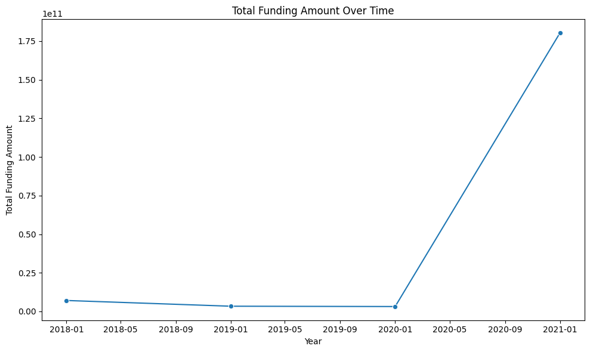
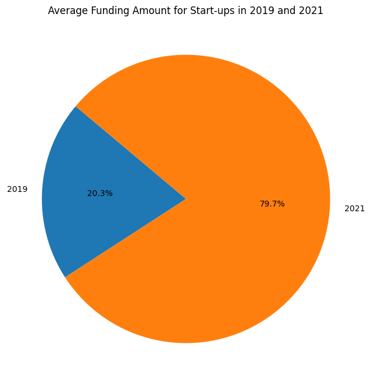
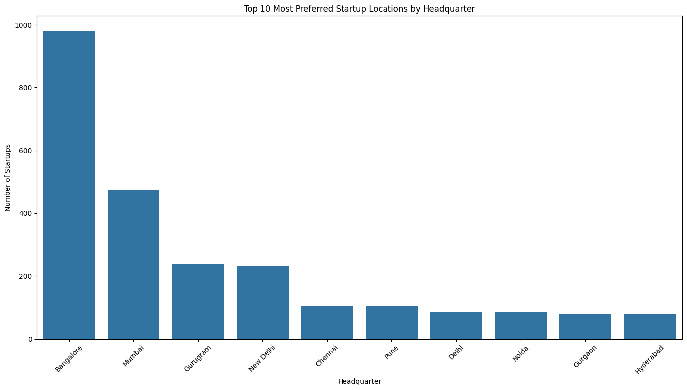
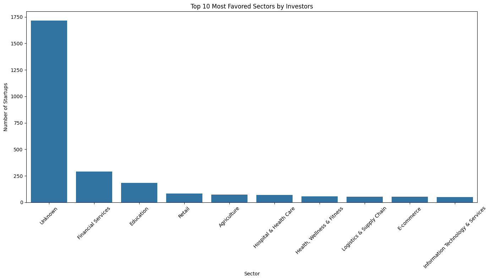
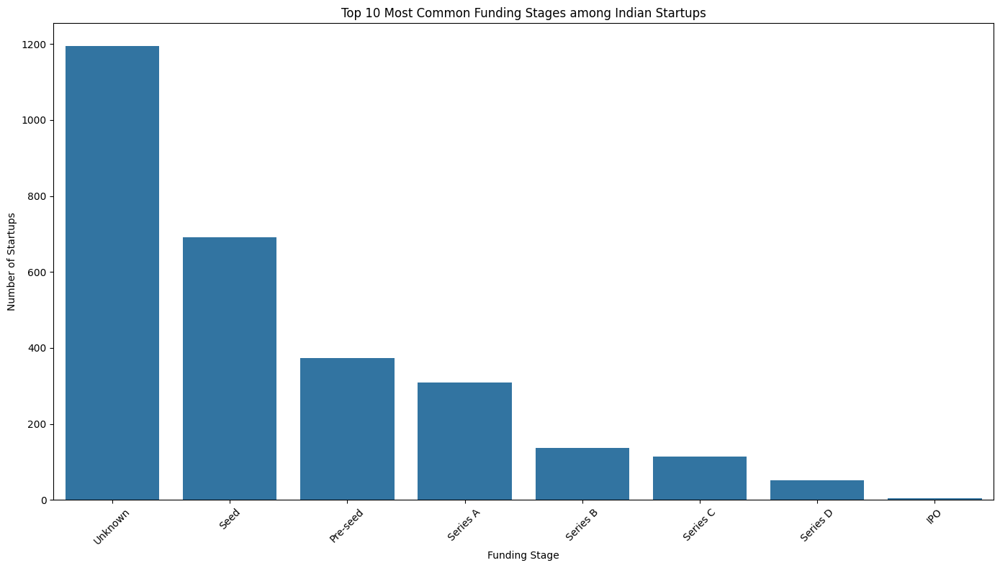

# Indian Start-Up Funding Data Analysis

This project analyzes funding data for Indian start-up companies between 2018 and 2021, providing insights into funding trends, sector popularity, and investment patterns using Pandas in Python.

## Features

- **Funding Trends Analysis**: Examine how funding to start-ups has changed over time.
- **Average Funding**: Calculate the average amount of funding for start-ups in different years.
- **Preferred Headquarters**: Identify the most popular locations for start-up headquarters.
- **Sector Analysis**: Determine which sectors are most favored by investors.
- **Funding Stages**: Analyze the most common funding stages among Indian start-ups.

## Visualizations

### PowerBI Dashboard 


1. **Funding Trends Over Time**  
   
   
2. **Average Funding Amount for Start-ups in 2019 and 2021**  
   

3. **Preferred Headquarters**  
   

4. **Top 10 Sectors Favored by Investors**  
   

5. **Most Common Funding Stages**  
   

## How to Use

1. Clone the repository.
2. Install required dependencies: `pyodbc`, `python-dotenv`, `pandas`, `seaborn`, `matplotlib`.
3. Run the script to perform analysis and generate reports.

## Example Outputs

```text
Most common sector: Technology
Most preferred headquarter: Bengaluru
```

## Installation

To run the analysis, you will need to install the following packages:

```bash
pip install pyodbc
pip install python-dotenv
pip install pandas
pip install seaborn
pip install matplotlib
```

## Data Loading and Cleaning

The data loading and cleaning process involves fetching data from various sources, renaming columns, handling missing values, and converting currency amounts.

## Exploratory Data Analysis (EDA)

### Funding Trends Over Time


### Average Funding Amount for Start-ups in 2019 and 2021


### Preferred Headquarters


### Top 10 Sectors Favored by Investors


### Most Common Funding Stages


## Conclusion

This project provides a comprehensive analysis of start-up funding in India from 2018 to 2021. The insights gained from this analysis can help inform strategic decisions for new ventures looking to enter the Indian market.

## Recommendations
- Visit [Link](https://app.powerbi.com/groups/me/reports/0b51fc42-452b-4a16-9d58-b2af797904bb/728c1bd97ea7ae915e17?experience=power-bi&clientSideAuth=0) to interact with the dashboard of this project.
- Focus on sectors that are most favored by investors, such as Technology and Financial Services.
- Consider establishing headquarters in popular locations like Bengaluru, Mumbai, and Gurugram.
- Pay attention to funding stages.
